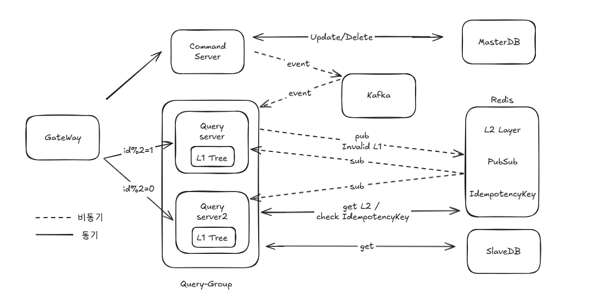
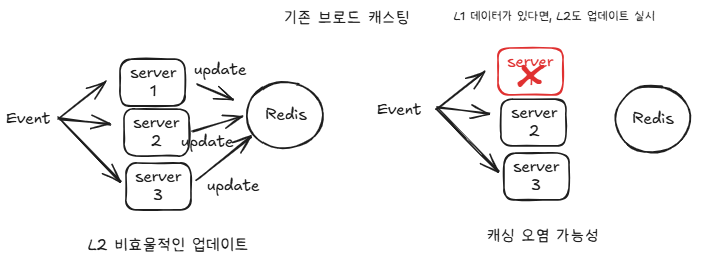
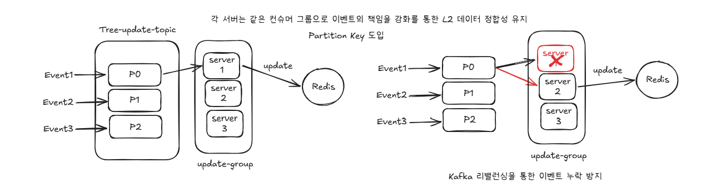
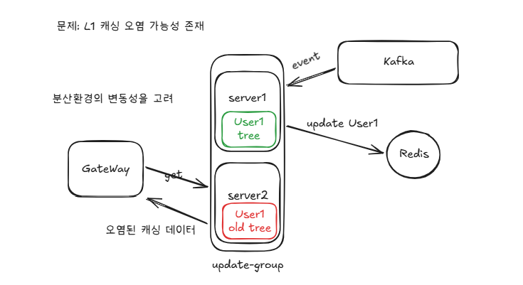
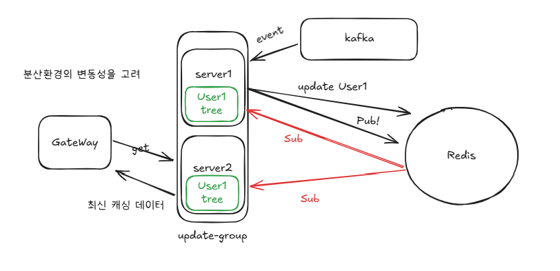
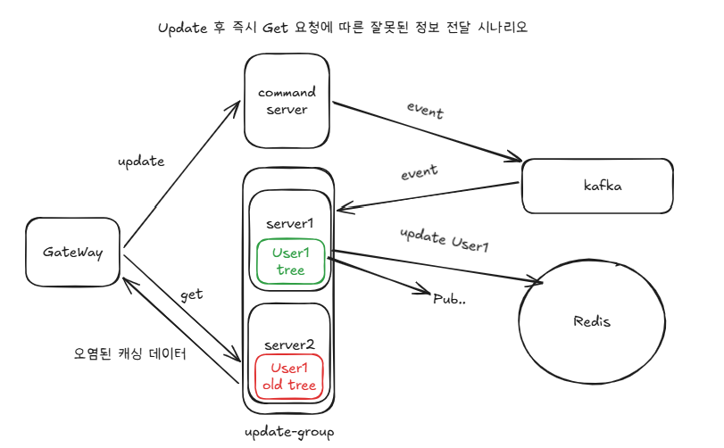
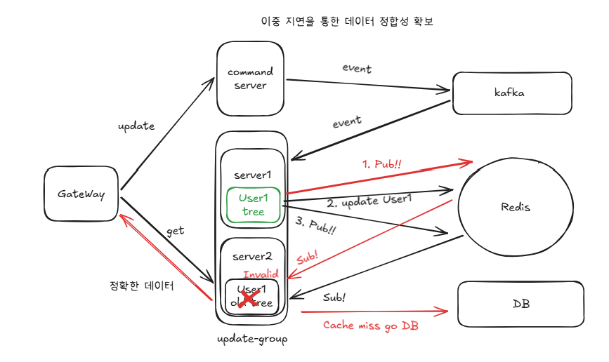
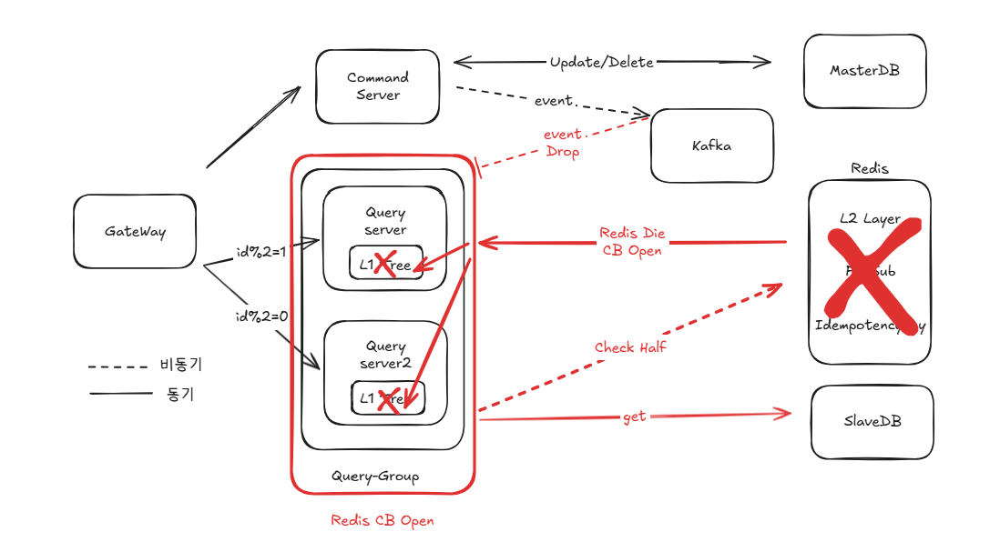

# 대규모 트래픽 환경을 위한 다중 캐싱 및 이벤트 기반(EDA) 분산 아키텍처
## 목차
1. [개요](#1-프로젝트-개요)
2. [기술 스택](#2-프로젝트-기술-스택)
3. [모듈 설명](#3-프로젝트-모듈-소개)
4. [프로젝트 아키텍처](#4-프로젝트-아키텍처)
5. [구현과정](#5-핵심-구현-과정)
6. [성능 검증](#6-성능-테스트-및-분산-환경-정합성-검증)

## 1. 프로젝트 개요

본 프로젝트는 이전 상위 프로젝트인 **["비동기 격벽 패턴을 통한 세그먼트 트리 캐싱 최적화"](https://github.com/Hi-Imjaeyoung/Grou-up)** 의 구조적 한계를 극복하고, MSA 기반의 서버 확장(Scale-out) 시 발생하는 분산 캐시 정합성 문제를 해결하기 위해 수행되었습니다.

상위 프로젝트에서는 "세그먼트 트리" 자료구조와 "트리 빌드 시 비동기 격벽(Bulkhead) 패턴"을 적용하여 단일 서버 환경에서의 극한의 성능 최적화를 이루어냈습니다. 하지만 이는 서버를 다중화(Scale-out)할 경우, 각 서버 간의 "로컬 캐시 데이터 동기화 및 정합성"을 보장하지 못한다는 치명적인 한계점을 갖고 있었습니다.

따라서 본 프로젝트에서는 실제 MSA 환경(CQRS)을 구축하여 해당 문제 상황을 재현하고, **"Kafka와 Redis를 활용한 이벤트 주도 아키텍처(EDA)"** 를 도입하여 다중 서버 환경에서의 데이터 정합성 문제를 완벽하게 해결했습니다.

---
## TODO (프로젝트 완료 후 삭제 예정)

- ### Architecture
  - [ ] Query-Server 조회용 NoSQL DB를 도입하여 CQRS 패턴 최적화
- ### Kafka
  - [ ] 최종 일관성 문제
  - [ ] SaGa 패턴 도입
  - [ ] OutBox 패턴 도입
  - [x] DMQ 도입
- ### WebFlux 
  - [ ] Circuit Breaker 도입
  - [x] 해시 기반 라우팅 도입
- ### Redis 
  - [ ] 분산 락 도입

## 변경 사항

### V 1.0 
  - MSA 기본 셋팅 설정 (멀티 모듈, Spring Cloud)
  - Kafka를 통한 L1(인메모리 트리) 정합성 확보
  - Redis를 통한 L2(원문 데이터 No 트리) 저장을 통한 DB 접근 최소화


### V 1.1
  - [GateWay] 중복되는 트리 빌드를 막기위해, 유저 Id를 통한 커스텀 라우팅 설정
  - [Kafka] BroadCasting 으로 발행되는 업데이트 이벤트 구조 한계 인식
    - 기존 BroadCasting 구조는 서버 내 해당 유저의 데이터가 없을 시 이벤트 무시, 이로 인한 L2의 정합성 오염 발생 가능성 확인
    - 분산 환경에서 서버의 수는 유동적으로 변화 가능, 따라 커스텀 라우팅 설정이 항상 특정 멤버의 특정 서버를 보장하지 못함.
  - [Kafka] PartitionKey 해싱을 통한 서버의 이벤트의 책임 강화
    - Query 서버들의 Group ID를 동일화 하여, BroadCasting 구조 탈피.
    - Member 의 PK를 통한 PartitionKey 해싱을 통한 각 서버의 이벤트 책임 강화.
    - 서버의 비정상적인 종료에 따른, 자동 Partition 재할당 확인.
  - [Redis] 회원 1명의 1년 트리 데이터 측정을 통한 L2 데이터 구조 변경 (원문 데이터 -> 캐싱 트리 데이터 )
    - 구조 변경에 따른 세그먼트 트리 빌드, 업데이트, 변수 대폭 수정.
    - 캐싱 무효화 "지연 이중 삭제" 도입에 따른 Pub/Sub 기능 추가.
    - command 모듈 Redis 의존성 제거 및 Query 모듈로 격리. 
  - [Docs] mermaid 작성

### V 1.2
- [GateWay] 
  - query-server Retry 필터 설정.
  - 커스텀 로드밸런서 해당 서버 상태 확인 기능 추가. 
- [Spring]
  - Query 모듈 Resilience4j 의존성 추가
  - CircuitBreaker 를 통한 Redis 장애 상태 전파
  - FallBack Method 추가
- [Kafka] 멱등성 검증 로직 추가
- [Redis] 멱등성 키 저장
- [Redis] L1 무효화 시그널 Pub/Sub 적용
---

## 2. 프로젝트 기술 스택

* **Language & Framework:** Java 17, Spring Boot 3.x, Spring Cloud (Eureka, Gateway)
* **Database:** MySQL (Master-Slave), Spring Data JPA, QueryDSL
* **Cache & Message Queue:** Redis, Caffeine Cache (In-Memory), Apache Kafka
* **Testing:** k6 (Load Testing), Postman

---

## 3. 프로젝트 모듈 소개
```text
global-cache-poc
 ├──  core(common)      # 공통 도메인 및 유틸리티
 ├──  command-server         # CUD (쓰기/수정/삭제) 전용 서버
 ├──  query-server           # Read (조회) 전용 서버 및 캐시 관리
 ├──  legacy-server # MSA 분리 전 서버
 ├──  eureka-server
 └──  api-gateway
```

### core 및 common
* 시스템 전체에서 공통으로 사용되는 핵심 도메인 모델, 공통 DTO, Exception 객체 및 유틸리티 클래스를 관리합니니다.
* 특정 인프라(DB, Message Queue 등)에 종속되지 않도록 설계하여 다른 모듈에서 가볍게 의존성을 주입받아 사용할 수 있습니다.

### command-server
* 사용자의 데이터 생성, 수정, 삭제(CUD) 요청을 전담하는 서버입니다.
* 트래픽 분산을 위해 조회 로직과 완벽히 격리되어 있습니다.
* 데이터 변경 발생 시, 데이터 정합성을 맞추기 위해 Kafka 프로듀서(Producer) 로 변경 이벤트를 발행(Publish)합니다.

### query-server
* 대규모 트래픽이 집중되는 대시보드 데이터 조회(Read)를 전담하는 서버입니다.
* 인메모리 세그먼트 트리(Segment Tree): O(logN) 속도로 범위 조회를 수행하기 위한 L1 캐시 트리를 메모리에 유지합니다.
* Redis 글로벌 캐시 (L2): 서버 다중화(Scale-out) 시 발생하는 DB 초기 로딩 병목(Cache Stampede)을 방어하기 위해 원문 데이터를 관리합니다.
* Kafka 컨슈머 (Consumer): Command 서버로부터 변경 이벤트를 수신하고, 이중 비동기 병목을 방지하기 위해 즉각적이고 동기적인 트리 부분 업데이트(Minus)를 수행합니다.

### legacy-server
* 아키텍처 분리 이전의 실제 프로덕션 코드를 재현한 베이스라인(Baseline) 서버입니다.
* 데아터의 조회,생성,삭제를 모두 이뤄집니다.
* query-server의 기능을 모두 포함하고 있습니다.

### eureka-server
* MSA 환경에서 기동 되는 각 마이크로서비스의 네이밍을 동적으로 등록하고 탐색할 수 있도록 지원하는 Service Discovery 서버입니다..

### api-gateway
* 클라이언트의 모든 요청(URL)을 단일 진입점에서 받아 적절한 마이크로서비스(command, query, legacy)로 라우팅합니다.
* Spring Cloud Gateway (WebFlux) 기반으로 구현되어, 논블로킹(Non-blocking) 비동기 처리를 통해 대규모 동시 접속 트래픽을 효율적으로 방어합니다.

### Infrastructure (Docker Compose)
로컬 테스트 및 완벽한 독립 실행 환경을 위해 Docker 기반으로 필수 인프라를 구성했습니다.
* Cache: Redis (L2 글로벌 캐시용)
* Message Queue: Kafka
  
  인프라 자원 소모를 줄이고 경량화하기 위해 Zookeeper가 제거된 최신 KRaft 모드를 채택하여 운영합니다.
* Database: MySQL
  
  조회와 쓰기의 부하 분산을 완벽히 테스트하기 위해 Master - Slave (Source - Replica) 구조의 Replication 설정을 적용하여 프로덕션(RDS) 환경을 모방했습니다.

-----

## 4. 프로젝트 아키텍처



````mermaid
sequenceDiagram
    autonumber
    
    actor User as Client
    participant Cmd as Command Server
    participant Kafka as Kafka (tree-update)
    participant QA as Query Server A<br/>(Event Consumer)
    participant QB as Query Server B<br/>(Subscriber)
    participant Redis as Redis (L2 , PubSub)
    participant DB as MySQL (Master)

    User->>Cmd: 결제/수정 요청 (CUD)
    Cmd->>DB: 원장 데이터 업데이트
    Cmd->>Kafka: 이벤트 발행 (Email, 변경분)
    
    Note over Kafka, QA: ⚡ 비동기 이벤트 스트리밍
    Kafka->>QA: 이벤트 수신 (@KafkaListener)
    
    Note over QA, Redis: [1차] L1 캐시 무효화
    QA->>Redis: Pub/Sub 방송 송출 (Evict L1)
    Redis-->>QA: L1 캐시 삭제 (스스로 청소)
    Redis-->>QB: L1 캐시 삭제 (동기화)
    
    Note over QA, Redis:[L2 업데이트] 세그먼트 트리 배열 연산
    Redis->>QA: L2 트리 데이터 Get 
    QA->>QA: L1/L2 배열 덧셈 로직 수행 
    QA->>Redis: 최신 L2 트리 Set
    
    Note over QA, QA: CompletableFuture 비동기 지연 실행
    QA-xQA: 500ms 대기 (논블로킹)...
    
    Note over QA, Redis: [2차] 지연 이중 삭제 
    QA->>Redis: Pub/Sub 2차 방송 송출 (Evict L1)
    Redis-->>QA: L1 캐시 2차 삭제
    Redis-->>QB: L1 캐시 2차 삭제
````


----

## 5. 핵심 구현 과정

### 1) MSA 환경 및 CQRS 패턴 구축
* 단일 서버의 단일 장애점(SPOF) 리스크를 극복하고 무한한 트래픽 확장을 위해 **Command(CUD) 서버와 Query(Read) 서버를 물리적으로 분리하고 다중화**했습니다.
* Spring Cloud Gateway(WebFlux)와 Eureka를 도입하여, 클라이언트 요청의 성격에 따라 적절한 서버로 트래픽을 완벽하게 라우팅하도록 구성했습니다.

### 2) 글로벌 L2 캐시(Redis) 도입을 통한 DB 부하 최소화
* Query 서버가 다중화됨에 따라, 각 서버가 최초 기동 시 트리 빌드를 위해 무거운 **"1년 치 Raw 데이터"를 DB에 중복 요청하는 병목 현상**이 발생했습니다.
* 이를 방지하기 위해 **Redis를 글로벌 임시 저장소(L2 캐시)** 로 도입했습니다. 최초 1회의 DB 조회 결과만 Redis에 적재하여, 이후 기동되는 Query 서버들은 네트워크 및 I/O 비용을 최소화하며 트리 빌드 과정을 최적화했습니다.

### 3) Kafka 기반의 분산 캐시 데이터 정합성 보장 (EDA)
* 다수의 Query 서버가 각자의 **메모리에 가진 L1 캐시 데이터 불일치 문제**를 해결하기 위해, **Kafka 이벤트 브로드캐스팅**을 적용했습니다.
* Command 서버에서 데이터의 수정 및 삭제 요청이 발생하면 ➡️ 즉시 글로벌 캐시(Redis)의 Raw 데이터를 무효화(Invalidate)하고 ➡️ Kafka로 '변경 이벤트'를 발행(Publish)합니다.
* 다중화된 모든 Query 서버는 해당 이벤트를 수신(Consume)하여, DB 재조회 없이 자신의 L1 세그먼트 트리에서 변경된 데이터만 부분 연산(Minus/Add) 하는 방식으로 100% 데이터 정합성을 달성했습니다.

### 4) 커스텀 분산 라우팅 구현
* 동일한 유저에 대해 기존 라우드 로빈 방식의 라우팅은 각 서버에 중복된 트리 빌드가 발생할 가능성이 높았습니다.
* 이를 해결하기 위해, 유저 id 기반으로한 커스텀 로드밸런서를 구축하여 중복 트리 빌드 가능성을 줄였습니다. 

### 5) Kafka Event 구조 변경

기존 브로드 캐스팅 구조의 이벤트 관리는 이벤트의 업데이트에 대해 낙관적인 구조를 갖고 있었습니다.
이는 캐싱의 오염이 일어날 가능성이 존재하였고, 이를 해결하기 위해 모든 컨슈머가 업데이트를 수행할 시
업데이트의 중복이 발생하게 되었습니다.

위 문제를 해결하기 위해 파티션 키 기반 이벤트 발행을 통해, 수신한 컨슈머의 이벤트 책임을 강화하였습니다.
나아가, 서버의 비정상적인 종료와 같은 L2 캐싱 오염상황에도 리밴런싱 기능을 통해 방지할 수 있었습니다.

### 6) L1 무효화 시그널 Pub/Sub 도입
 
각 서버는 L1에 대한 시그널이 존재하지 않았음으로, 업데이트 이벤트를 수신한 서버가 아닌 경우
L1의 최신화 혹은 무효화가 이뤄저야한다는 점을 알 수 없었습니다. 


이 문제를 해결하기 위해
Redis의 Pub/Sub 기능을 통해 'L1 무효화 시그널'을 각 서버에 전파하였습니다.


하지만, 만일 업데이트를 요청한 유저가 업데이트 후 즉시 데이터 조회를 요청한 경우에는 
위와 같은 문제가 발생하게 되었습니다. 이벤트를 수신한 서버의 작업이 이뤄지기 전 사용자는 
오래된 데이터를 받게될 가능성이 존재했습니다. 


사용자의 구식 데이터를 받을 가능성을 최소화 하기위하여, 이중 지연을 통한 삭제 전파 구조를 도입하였습니다.
이벤트를 수신한 서버에서 우선 즉시 L1 무효화 신호를 전파하고, L2 레이어의 최신화를 수행하였습니다.
그리고 잠시 대기 후, 한번 더 L1 무효화 신호를 재전파하여 캐싱 오염 가능성을 최소화 했습니다.  

### 7) CircuitBreaker를 통한 장애 전파 및 FallBack 로직 구현



---

## 6. 성능 테스트 및 분산 환경 정합성 검증

### 1) MSA 환경에서의 부하 테스트 결과 및 안정성 확인
k6 부하 테스트를 통해 아키텍처의 높은 안정성과 Cache Warming 생태를 검증했습니다. [부하 테스트 스크립트 (Link)](https://github.com/Hi-Imjaeyoung/global-cache-poc/blob/5bd0861f96d33569247180796840b96baa34c591/k6Test/load-test.js)

* **부하 테스트 결과 (VUs 500, 혼합 부하)**

| 테스트 환경 (시나리오) | 처리량 (RPS) | 상위 95% (p95) | 중앙값 (Median) | 에러율 | 비고 (상태 요약) |
| :--- | :--- | :--- | :--- | :--- | :--- |
| **단일 서버 (Single Node)** | **307.69** | **129.44ms** | **7.69ms** | 0.00% | 자원 독점 및 L1 캐시/비동기 처리를 통한 극한의 성능 최적화 |
| **MSA 1회차 (Cold Start)** | 141.05 | 2.9s | 1.2s | 0.00% | 다중 JVM 경합 및 일제히 초기 트리 빌드 진행 |
| **MSA 2회차 (Warming)** | 265.14 | 939.17ms | 55.68ms | 0.00% | L1 트리 캐시 적재 시작 (중앙값 수직 하락) |
| **MSA 3회차 (Stable)** | 290.12 | **420.45ms** | 25.05ms | 0.00% | 로컬 리소스 한계 속에서도 목표 수치(500ms) 방어 성공 |

지표상으로는 로컬 자원을 독점한 단일 서버가 우수해 보일 수 있으나, 이는 1대의 물리 머신에서 6개의 JVM(Gateway, Command, Query x3)과 3개의 Docker 컨테이너가 경합하여 발생한 물리적 한계입니다.

> 극한의 컨텍스트 스위칭 속에서도 **에러율 0%** 를 방어해 냈으며, 실제 독립된 클라우드 노드(EC2) 환경에 배포 시 **단일 서버의 초고속 응답을 유지한 채 무한한 트래픽 확장이 가능한 아키텍처**임을 확인했습니다.

### 2) 분산 환경 데이터 정합성 완벽 검증
Command 서버에서 데이터의 수정/삭제가 발생했을 때, 스케일 아웃된 다수의 Query 서버들이 각자의 로컬(L1) 캐시 트리를 정확히 동기화하는지 자체 E2E 스크립트로 검증했습니다. [정합성 검증 테스트 코드 (Link)](https://github.com/Hi-Imjaeyoung/global-cache-poc/blob/5bd0861f96d33569247180796840b96baa34c591/k6Test/consistency-test.js)

* **검증 시나리오:** Command 서버 삭제 요청(CUD) ➡️ Kafka 이벤트 브로드캐스팅 ➡️ 3대의 Query 서버 개별 타격 및 응답값 비교
* **정합성 테스트 결과:**

<div align="center">
    
</div>

> **DB I/O 제로(0) 및 완벽한 결과적 일관성 달성** <br>
> DB 재조회 로그가 단 한 건도 발생하지 않았으며, 오직 Kafka 이벤트 수신만으로 3대의 독립된 Query 서버가 즉시 동일한 값으로 캐시를 부분 업데이트 하여 완벽한 데이터 정합성을 유지함을 확인했습니다.


### 3) 카오스 검증: Kafka 리밸런싱 및 멱등성 검증

### 4) 카오스 검증: Redis SPOF 에 따른 FallBack 및 자가 회복 검증